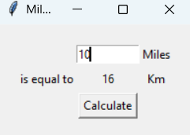

# 📏 Mile to Kilometer Converter

This is a simple GUI-based Python application built using `Tkinter` that converts distances from miles to kilometers.

---

## 🖥️ How It Works

- Enter a distance in miles.
- Click the **Calculate** button.
- The equivalent distance in kilometers is displayed.

---

## 📷 Screenshot

